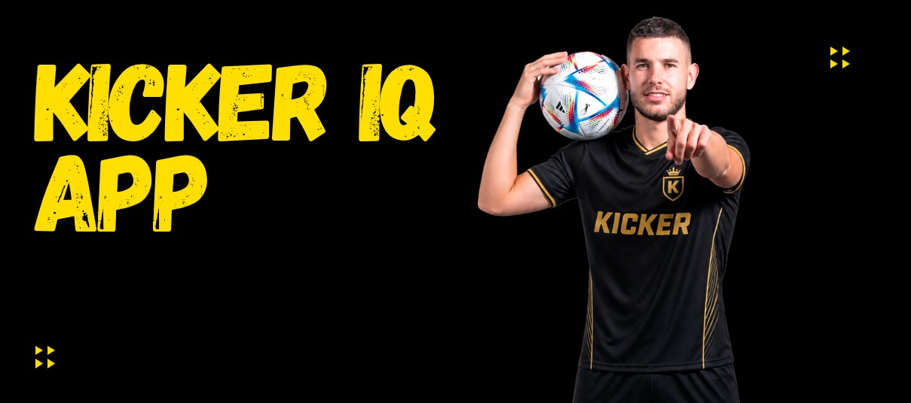
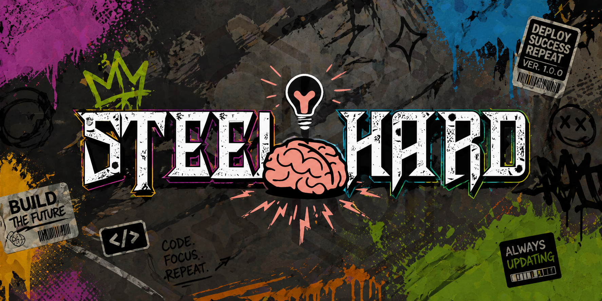
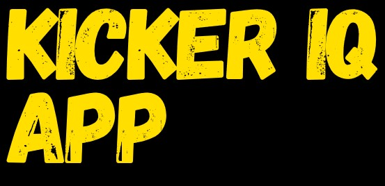

# 
# 

<div align="center">
<h1>
<a href="#descrição">Descrição</a> || 
<a href="#tecnologias">Tecnologias</a> || 
<a href="#dev-team">Dev Team</a> || 
<a href="#product-backlog">Product Backlog</a> || 
<a href="#scrum">Scrum</a> || 
<a href="#instalação">Instalação</a> || 
<a href="public/docs/ABP_VESTA.pdf">Diretrizes</a>
</h1>
</div>

## 📝 Descrição


<div style="text-align: justify;">

  <h2 style="text-align: justify;">
    Bem vindos!
  </h2>
  <p>Steel-Hard entrega o Kicker_IQ, software para apoio à tomada de decisão em elencos de futebol! Nosso projeto usa de tecnologias correntes e técnicas avançadas no desenvolvimento de software.</p>
  <p style="text-align: justify;">
    O <strong>Kicker_IQ</strong> consiste no desenvolvimento de um protótipo de sistema de informações inteligente focado no monitoramento e <strong>análise de desempenho físico de atletas de futebol</strong>. O objetivo central é transformar grandes volumes de dados históricos de jogadores em insights com técnicas de machine learning para que uma comissão técnica realize uma avaliação, otimizando a preparação física e a tomada de decisão tática.
  </p style="text-align: justify;">
  <br>
</div>


## 🛠️ Tecnologias

### Frontend


### Backend & API


### Machine Learning & Data Science


### Infraestrutura & Ferramentas


---

## 🔄 Scrum
| Sprint                                    | Início     | Fim        | Status           | 📉 Burndown Chart                                        | Sprint Backlog/Review  |
|:-----------------------------------------:|:----------:|:----------:|:----------------:|:---------------------------------------------------------:|:-----------------:|
| 1 | 13/04/2026 | 30/04/2026 | 🟢 Concluído    | [Ver Gráfico](assets/burndown_1.png) |  [Ver](docs/sprint1.md) |
| 2 | 04/05/2026 | 21/05/2026 | 🟠 Em andamento  | [Ver Gráfico](assets/burndown_2.png) |  [Ver](docs/sprint2.md) |
| 3 | 25/05/2026 | 11/06/2026 | 🔴 A Fazer | [Ver Gráfico](assets/burndown_sp3.png) |  [Ver](docs/sprint3.md) |

---
## Definition of Done
Quando os User Stories estiverem completos e entregues, o projeto estará pronto.

## 📋 User Stories

| Pontos | ID    | User Story | Critérios de Aceitação |
|--------|-------|------------|------------------------|
| 13     | US01  | Como usuário, quero importar dados históricos de partidas para o sistema, para iniciar as análises de desempenho. | a) O sistema deve permitir o upload de arquivos contendo indicadores como carga de trabalho, distância de sprint e velocidade máxima.<br>b) Os dados importados devem ser validados para garantir a integridade e evitar inconsistências. |
| 8      | US02  | Como usuário, quero importar novos dados após cada partida, para manter o sistema atualizado. | a) Novos dados devem ser anexados à base histórica sem sobrescrever informações anteriores de forma indevida. |
| 13     | US03  | Como técnico, quero que o sistema identifique automaticamente perfis de jogadores, para entender suas características de jogo. | a) O sistema deve classificar automaticamente os atletas em categorias como "explosivo", "alta resistência", "baixa intensidade" ou "alta carga de impacto".<br>b) A classificação deve ser baseada em métodos de inteligência artificial.<br>c) O processamento deve ser realizado em serviços de nuvem |
| 21     | US04  | Como técnico, quero comparar jogadores com base em seus indicadores e perfis, para ajustar treinos e identificar substitutos. | a) Deve ser possível selecionar dois ou mais atletas para comparação lado a lado de seus perfis e indicadores.<br>b) O sistema deve sugerir substitutos com perfis semelhantes aos de um jogador selecionado. |
| 21     | US05  | O sistema deve comparar os indicadores da partida atual com a média histórica do próprio jogador para identificar desvios. | a) Deve haver login com senha para o usuário e para os cuidadores.<br>b) A detecção de quedas deve ser feita de forma automatizada pelo sistema. |
| 5      | US06  | Como técnico, quero receber alertas quando houver queda de desempenho, para agir imediatamente. | a) Ao detectar uma anomalia relevante, um alerta visual ou notificação deve ser disparado para a comissão técnica. |
| 13     | US07  | Como técnico, quero visualizar dashboards com indicadores de desempenho, para interpretar os dados facilmente. | a) Os resultados das análises devem ser apresentados de forma clara, permitindo interpretação objetiva.<br>b) As visualizações devem ser adequadas para cada tipo de indicador de desempenho.<br>c) A interface deve ser intuitiva e centrada na experiência do usuário. |
| 13     | US08  | Como técnico, quero acessar o sistema pelo celular, para acompanhar os dados em qualquer lugar. | a) O sistema deve possuir interface responsiva que se adapte a diferentes tamanhos de tela de dispositivos móveis.<br>b) Todas as análises disponíveis no desktop devem estar acessíveis via mobile.<br>c) O acesso deve ser protegido por mecanismos de segurança e criptografia de dados. |
## 📋 Product Backlog
| Número | Recurso Funcional           | Síntese do Requisito                                         | Status          |
|:------:|-----------------------------|:------------------------------------------------------------:|:---------------:|
|  RF01  | Importação de Histórico           | Importar dados históricos de desempenho dos jogadores para o banco de dados                           | 🟢 <br> Concluído |
|  RF02  | Atualização de Partidas        | Permitir a importação de novos dados conforme a ocorrência de novos jogos              | 🔴 <br>A Fazer |
|  RF03  | Profiling com IA        | Identificar automaticamente perfis de jogadores          | 🟢 <br> Concluído |
|  RF04  | Comparativo de Atletas    | Permitir a comparação entre jogadores para ajuste de treino e identificação de substitutos               | 🔴 <br>A Fazer |
|  RF05  | Detecção de Desempenho   | Detectar automaticamente quando o desempenho de um atleta está diferente do seu padrão histórico               | 🟢 <br>Concluído |
|  RF06  | Emissão de Alertas    | Emitir alertas para a comissão técnica ao detectar anomalias ou quedas relevantes               | 🔴 <br>A Fazer |
|  RF07  | Dashboards de Análise    | Apresentar indicadores de desempenho através de visualizações gráficas adequadas               | 🟢 <br>Concluído |
|  RF08  | Acesso Mobile    | Garantir que as análises e dados estejam acessíveis através de dispositivos móveis               | 🔴 <br>A Fazer |

| Número  | Recurso Não-Funcional       | Síntese do Requisito                                         | Status          |
|:-------:|-----------------------------|:------------------------------------------------------------:|:---------------:|
|  RNF01  | UX e Responsividade              | Interface intuitiva e centrada no usuário para ambientes web e mobile               | 🟢 Concluído |
|  RNF02  | Segurança de Dados        | Proteção e criptografia de dados sensíveis em trânsito e em repouso             | 🟢 Concluído |
|  RNF03  | Performance        | Desempenho adequado para processamento e exibição de análises em tempo real               | 🟢 Concluído |
|  RNF04  | Integridade        | Garantir que os dados importados sejam confiáveis e livres de inconsistências               | 🟢 Concluído |
|  RNF05  | Clareza Analítica        | Disponibilizar resultados de forma clara para interpretação objetiva da comissão               | 🟢 Concluído |


## ⚙️ Instalação

 1. CLONE DOS PROJETOS (ORQUESTRADOR  E MICROSERVICES)
 ``` BASH
 git clone https://github.com/Steel-Hard/Kicker_IQ && cd Kicker_IQ && for repo in https://github.com/Steel-Hard/Kicker_IQ-model-kmeans https://github.com/Steel-Hard/Kicker_IQ-model-service; do git clone "$repo"; done
 ```
 2. RODAR DOCKER
 ```BASH
 docker-compose up --build
 ```


## 🧮 Trello
Foi utilizado o trello para gerenciar as demandas e andamento do projeto, abaixo o link para visualizar:
[Trello](https://trello.com/b/D3Ij59uJ/kicker)


## 👨‍💻 Dev Team

| Nome                               | Função              | GitHub                                          |
|:----------------------------------:|:-------------------:|:-----------------------------------------------:|
| Maurício Oliveira Medeiros Cepinho                     | Product Owner       | [GitHub](https://github.com/maucepinho)           |
| Cláudio dos Santos Siqueira Júnior |  Scrum Master     | [GitHub](https://github.com/claudsaints)        |
| Lucas Roque Alvim Cruz             | Dev Team (Front-end)| [GitHub](https://github.com/lucasroqe)          |
| Nícolas Aquino    | Dev Team (Front-end) | [GitHub](https://github.com/Nickaqui)         |
| Luiz Felipe dos Santos             | Dev Team (Machine Learning) | [GitHub](https://github.com/felipe-sant)      |
| Vitor Francisco de Azevedo Zonzini |Dev Team (Back-end)    | [GitHub](https://github.com/frevisto)           |
| Victor Hugo Dantas Carbajo         | Dev Team (Machine Learning)| [GitHub](https://github.com/Victor-Carbajo-DSM) |


## Convenções de Commit


Para seguir boas práticas de commits no seu projeto, consulte o repositório:  
[Padrões de Commits](https://github.com/iuricode/padroes-de-commits).